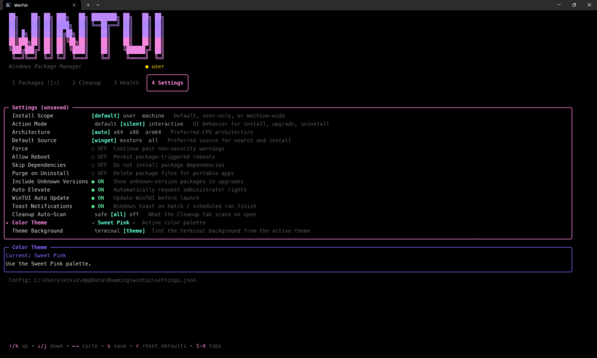
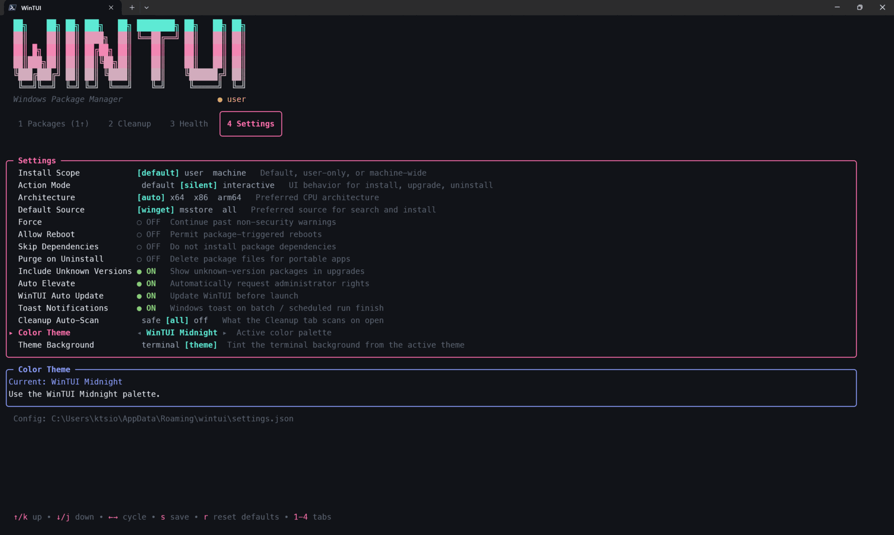
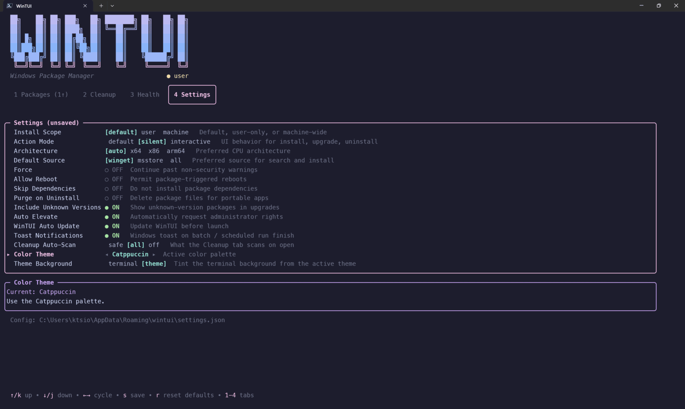
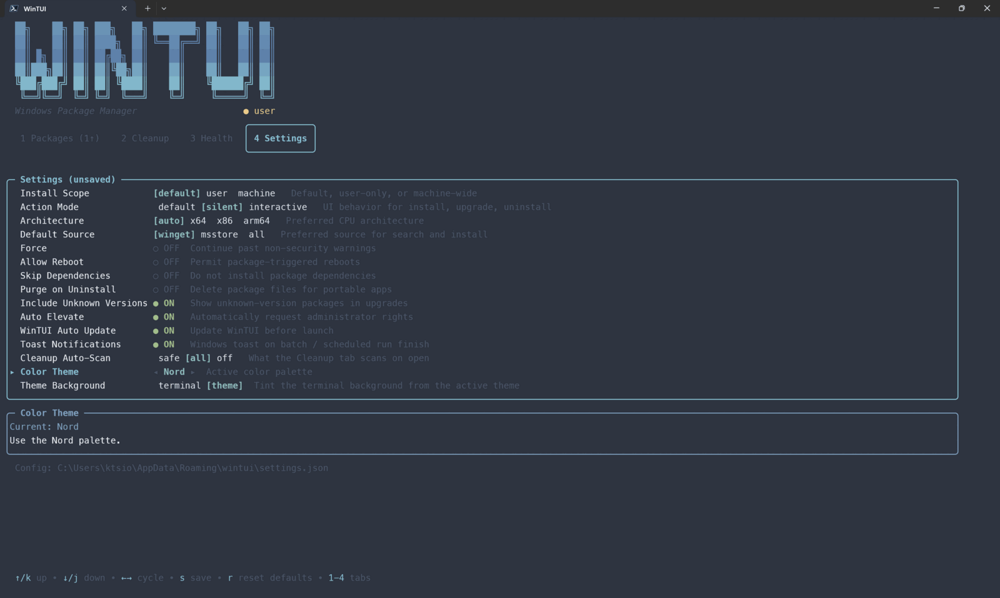
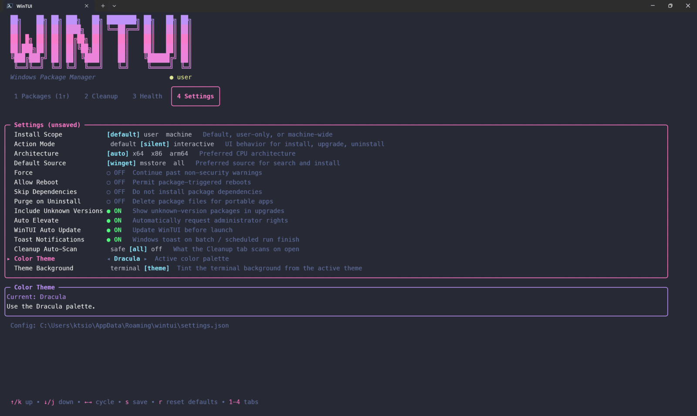
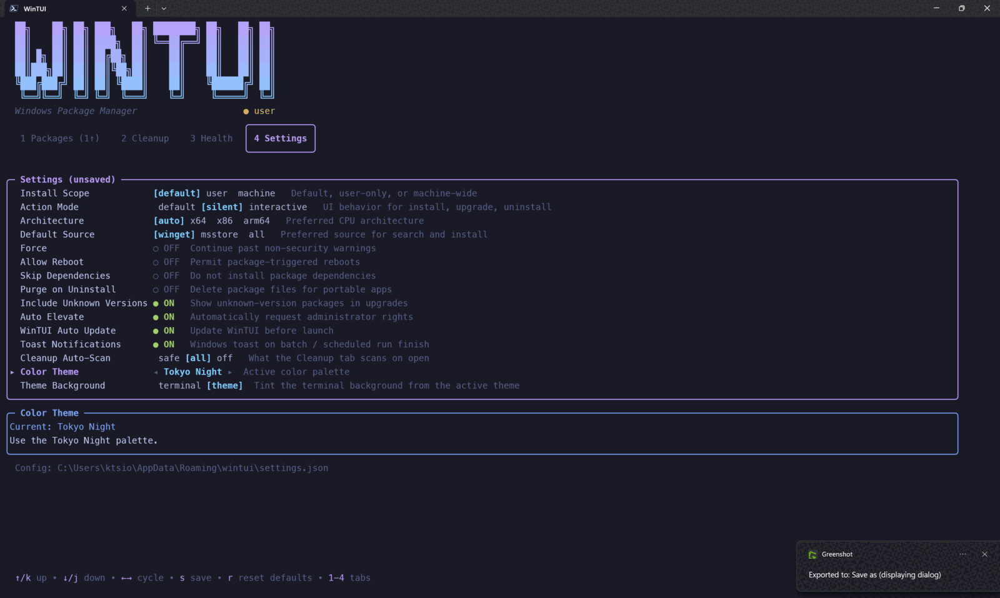
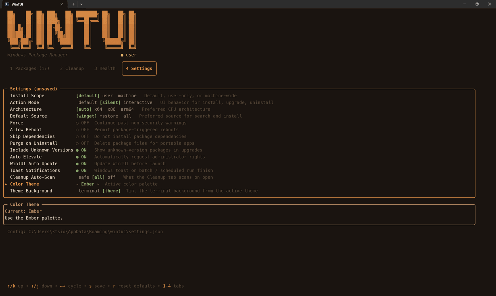
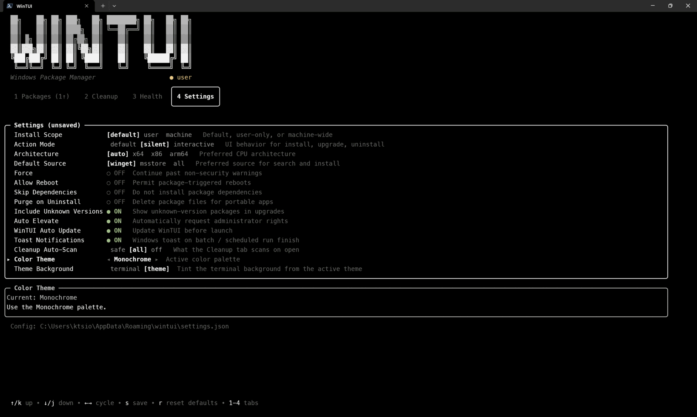

# WinTUI

[](https://goreportcard.com/report/github.com/kts982/wintui)
[](https://github.com/kts982/wintui/actions/workflows/ci.yml)
[](https://github.com/kts982/wintui/releases/latest)
[](https://github.com/microsoft/winget-pkgs/tree/master/manifests/k/kts982/WinTUI)
[](LICENSE)

A terminal user interface for **winget** (Windows Package Manager), built with Go and the [Charmbracelet](https://charm.sh) TUI libraries.

Browse, search, install, upgrade, and manage Windows packages without leaving the terminal.
WinTUI features a split-panel workspace, batch operations with a single UAC prompt, and a headless CLI mode for scripting.


## Install

**Requirements:** Windows 10/11 with winget installed.

```powershell
winget install kts982.WinTUI
```

Or install manually:

```bash
# Run a release binary
.\wintui.exe

# Or build/install with Go 1.26+
go install github.com/kts982/wintui@latest

# Or clone and build from source
git clone https://github.com/kts982/wintui.git
cd wintui
go build -o wintui.exe .
```

Pre-built binaries are available on [GitHub Releases](https://github.com/kts982/wintui/releases) — both `.exe` and `.zip` for Windows amd64 and arm64:

```bash
gh release download --repo kts982/wintui --pattern '*windows_amd64.exe'
```

## Features

**Unified Packages Screen**
- **Split-panel layout** — package list on the left, detail summary on the right
- **Bordered sections** — Updates Available, Installed, Search Results, and Install Queue with package counts and active focus highlighting
- **Normalized package actions** — press `Space` to stage the focused package, `g` to apply staged changes, or use `i` / `u` / `x` for direct install, upgrade, and uninstall accelerators
- **Search & Install** — press `s` to search the winget catalog, `Space` to queue packages, `i` to install the focused result or the full install queue
- **Upgrade / Uninstall** — stage packages across sections, then apply them together, or use `u` / `x` on the focused package or current selection
- **Export / Import** — press `e` to drop the installed package list as a dated JSON on your Desktop, or `Shift+I` to open the import overlay (scans Desktop / home / cwd for export files, lets you toggle which entries to install). The same flow is also headless via `wintui export` and `wintui import`
- **Package Details** — press `Enter` or `→` for a full detail overlay with version picker (`v`), homepage (`o`), release notes (`n` when available), Auto/Ask/Hold package policy, a live command preview showing exactly what winget will run (including per-package overrides), and scrollable metadata
- **Batch Execution Modal** — review selected packages, press `?` to preview the exact winget command for each one, watch live progress with per-package spinners and the most recent winget output line, view compact results with `Ctrl+E` retry (elevated when needed, plain retry for process-in-use failures)
- **Version Selection** — pick a specific version to install or upgrade to from the detail panel
- **Self-upgrade handoff** — WinTUI can check for its own winget update before launch and close so a local handoff script can run `winget upgrade kts982.WinTUI` after the current process exits
- **Headless CLI** — `wintui check`, `wintui list [query]` (filter installed packages by name/id, like `winget list`), `wintui show <id>`, `wintui upgrade --all`, `wintui upgrade --auto`, `wintui upgrade --id <pkg>`, `wintui upgrade --self`, `wintui notes <id>`, `wintui theme`, `wintui doctor` (verdict-first readiness check), `wintui history` (a log of WinTUI-originated upgrades), and `wintui fix --portable` (pin portable packages to user scope) for scripts, Task Scheduler, or CI without launching the TUI; `--json` works on `check`, `list`, `show`, `doctor`, `notes`, `history`, and `fix --portable`. Help, usage, errors, and `--version` are styled with [fang](https://github.com/charmbracelet/fang) to match your theme, with shell completions via `wintui completion <shell>` (package IDs complete from the cache on `upgrade --id` and `show`, and from history on `history`)
- **`wintui notes <id>`** — render a package's latest-version release notes (themed markdown via a small built-in renderer) when the winget manifest provides them, with a URL fallback otherwise; `wintui check --notes` renders the notes for every pending update inline, so you can review what you're about to install before upgrading
- **`wintui theme [name] [--list]`** — show, list, or set the color theme from the CLI (also surfaced as an INFO row in `wintui doctor`)
- **`wintui upgrade --self`** — upgrade WinTUI itself from the CLI via the startup self-update handoff (the other upgrade modes deliberately skip the running binary), so CLI-only users stay current without launching the TUI
- **`wintui history [id]`** — a log of the install/upgrade/uninstall operations WinTUI itself runs (TUI batches and headless `upgrade` / `import`), newest first, so scheduled CLI upgrades leave a trace; pass an id for that package's timeline. `--limit` / `--since` / `--failed-only` / `--json`, and exit 1 when a selector matches nothing (a "did WinTUI touch this?" predicate). Records WinTUI-originated actions only — winget has no event feed for external `winget` / Store changes. Stored at `%APPDATA%\wintui\history.json`
- **`wintui fix --portable`** — pins portable winget packages (CLIs like `claude`, `gum`, `ffmpeg`) to user scope so a future `winget upgrade` can't strip them from PATH ([winget-cli #4044/#5099](https://github.com/microsoft/winget-cli/issues/4044)); writes a per-package `scope: user` + `elevate: false` override, idempotent, with `--dry-run` to preview. `wintui upgrade` also nudges toward it when an at-risk portable package is about to upgrade

**System Utilities**
- **Health Tab** — slim WinTUI / winget readiness panel: WinTUI version + path, winget version, source freshness, cached upgrade counts (visible / auto / held + cache age), privileges + Auto Elevate context, system drive free space, and a neutral Settings summary line. Loads instantly — no fresh winget calls or disk scans
- **`wintui doctor`** — verdict-first headless health (`OK` / `WARN: N issues` / `FAIL: N issues`, exit 0/1/2). `--verbose` adds the per-row table; `--full` re-adds verbose system diagnostics (RAM, Defender, drives, ping, Windows PowerShell); `--dev-tools` appends a developer-tools detection group; `--json` emits structured output for scripts
- **Toast notifications** — opt-in (off by default). When enabled, fires a single Windows toast on TUI batch finish, on `wintui upgrade --auto/--all` finish, and when `wintui check` finds updates. AUMID-attributed as "WinTUI" via a one-time Start Menu shortcut drop on first toast
- **Cleanup tab** — registry-driven multi-target cleanup with grouped panels (Core Temp, Caches, Developer caches, GPU shader caches, WinTUI self-update scratch), per-target sizing, age-aware scrubbing, and an elevated helper for admin-only paths (`%WINDIR%\Temp`, system minidumps). Configurable auto-scan policy (`safe` / `all` / `off`); developer caches default to off and opt-in toggles persist across sessions
- **Settings** — persistent config for winget options (scope, architecture, silent/interactive, force, purge, etc.)

**UX**
- **Disk-persistent cache** — instant startup from cached data, background refresh for always-fresh results, per-package incremental updates after actions
- **Update count badge** in the tab bar — see available updates at a glance before winget finishes refreshing
- 4-tab layout: Packages, Cleanup, Health, Settings
- Boxed tab bar with animated gradient ASCII logo
- Context-sensitive help bar that adapts to the active section
- Full help panel on `?` with grouped keybindings
- Fuzzy filter (`/`) on the installed package list
- Per-tab screen state preserved across tab switches
- Built-in elevated helper — silent + auto-elevate runs everything elevated upfront, avoiding UAC popups from installers
- `Ctrl+E` elevated retry on the result modal when auto-elevate is off
- Responsive layout — detail panel hides on narrow terminals, compact header on small screens

## Themes

Eight curated palettes ship in the box. Each one has matching Dark
and Light variants — WinTUI detects your terminal background at
startup and picks the right one, so themes read correctly on both
without any configuration.



Open **Settings** (tab `4`), arrow down to **Color Theme**, then use
`←` / `→` (or `Space`) to cycle. Changes apply live.

<details>
<summary><b>Theme gallery</b> — click to expand all eight stills</summary>

| | |
|---|---|
|  **Sweet Pink** — the default |  **WinTUI Midnight** |
|  **Catppuccin** |  **Nord** |
|  **Dracula** |  **Tokyo Night** |
|  **Ember** |  **Monochrome** |

</details>

See the [theme gallery](docs/themes.md) for full-size screenshots and
notes on each palette, including the opt-in **Theme Background**
setting that tints your terminal background via OSC 11.

## Usage

```bash
.\wintui.exe
```

> **Tip:** Some operations require administrator privileges. The subtitle bar shows `● admin` / `● user` status. Enable **Silent** mode + **Auto Elevate** in Settings for hands-off elevated operations, or press `Ctrl+E` on the result modal when a package fails. WinTUI's own update is handled by closing WinTUI and letting winget replace the released binary; after the handoff finishes, start `wintui` again manually.

### Headless CLI

```powershell
# Human-readable upgrade check (honors per-package update policy)
wintui check

# Exit code 1 when visible updates are available
wintui check ; if ($LASTEXITCODE -eq 1) { "Updates available" }

# Machine-readable output
wintui check --json
wintui list --json > packages.json

# Filter installed packages by name/id — "is Firefox installed?" (exit 1 if not)
wintui list firefox

# Inspect what WinTUI would pass to winget for a given package
wintui show Mozilla.Firefox --json

# Upgrade everything that is not held
wintui upgrade --all

# Upgrade only packages marked Auto
wintui upgrade --auto

# Upgrade specific packages by ID (repeatable; pipe-friendly)
wintui upgrade --id Mozilla.Firefox --id Microsoft.VisualStudioCode

# Upgrade WinTUI itself (the modes above skip the running binary)
wintui upgrade --self

# Read release notes — one package, or every pending update before upgrading
wintui notes Git.Git
wintui check --notes

# Show/set the color theme
wintui theme --list
wintui theme nord

# Review what WinTUI has upgraded (scheduled runs leave a trace now)
wintui history
wintui history Mozilla.Firefox          # one package's timeline

# Pin portable packages to user scope so a future upgrade can't drop them from PATH
wintui fix --portable --dry-run
wintui fix --portable

# Export and re-import package lists across machines
wintui export --output packages.json
wintui import packages.json --dry-run     # preview before installing
wintui import packages.json               # install the safe subset

# Enable Tab completion (this session); add to $PROFILE to make it permanent
wintui completion powershell | Out-String | Invoke-Expression
```

Completion isn't automatic — PowerShell can't introspect an external `.exe`,
so the completer must be registered once (in your `$PROFILE` to persist). See
[docs/cli.md → Enabling shell completions](docs/cli.md#enabling-shell-completions)
for the persistent / cached setup and the `MenuComplete` tip.

The old root flags `--check` and `--list` have been removed; use
`wintui check` and `wintui list`. `--all` / `--auto` / `--id` deliberately
skip the running WinTUI binary; use `wintui upgrade --self` to update WinTUI
itself from the CLI (it runs the same startup handoff and ignores the Auto
Update setting since you asked for it explicitly).

Further documentation:
- [CLI reference](docs/cli.md)
- [Elevation and retry behavior](docs/elevation.md)

## Keyboard Shortcuts

### Packages Screen

| Key | Action |
|---|---|
| `↑↓` / `j/k` | Navigate |
| `PgUp` / `PgDn` | Jump 10 rows up / down |
| `Home` / `End` | Jump to top / bottom of the cursor's section |
| `Space` | Stage package / queue search result |
| `Enter` / `→` / `l` | Open package details |
| `←` / `Esc` / `h` | Close details / cancel |
| `Esc` | Dismiss search results / close details |
| `s` | Search & install (search winget catalog) |
| `/` | Filter installed packages |
| `g` | Apply staged changes |
| `u` | Upgrade selected or focused package |
| `x` | Uninstall selected or focused package |
| `t` | Cycle focused winget/msstore package update policy: Ask → Auto → Hold |
| `i` | Install queued packages or focused search result |
| `a` | Stage all available updates |
| `v` | Pick version (in detail view) |
| `c` | Reset to latest version (in detail view) |
| `o` | Open homepage (in detail view) |
| `n` | Open release notes URL (in detail view, when available) |
| `p` | Open per-package rules editor (detail view or list) |
| `i` | Toggle ignore on the focused package (in detail view) |
| `?` | Expand winget command preview for each item (in batch confirm modal) |
| `r` | Refresh package data |
| `Ctrl+E` | Retry failed packages (result modal) — elevated retry for permission failures, plain retry for items blocked by a running process |
| `?` | Toggle full help panel |

### Global

| Key | Action |
|---|---|
| `1-4` | Switch tabs |
| `Tab` / `Shift+Tab` | Cycle tabs |
| `q` | Quit |

## Settings

Configurable from the Settings tab, stored in `%APPDATA%\wintui\settings.json`:

| Setting | Options |
|---|---|
| Install Scope | user / machine / auto |
| Action Mode | auto / silent / interactive |
| Architecture | x64 / x86 / arm64 / auto |
| Default Source | winget / msstore / auto |
| Force | skip non-security issues |
| Allow Reboot | permit reboots during install |
| Skip Dependencies | don't process dependencies |
| Purge on Uninstall | delete all package files |
| Include Unknown Versions | show packages with unknown versions |
| Auto Elevate | automatically request admin rights |
| WinTUI Auto Update | check for and apply WinTUI's own update before launch |
| Toast Notifications | Windows toast on TUI batch finish, scheduled `wintui upgrade --auto/--all`, and `wintui check` finding updates (off by default) |
| Color Theme | Sweet Pink, WinTUI Midnight, Catppuccin, Nord, Dracula, Tokyo Night, Ember, or Monochrome |
| Theme Background | terminal / theme background tinting |

**Action Mode: Silent + Auto Elevate** runs all install/upgrade/uninstall operations through the elevated helper upfront, avoiding UAC popups from installers that elevate themselves.

**Auto Elevate** (without silent mode) retries automatically on hard permission errors. When a batch finishes with failures, the result modal offers `Ctrl+E` to retry only the failed elevation-candidate packages.

**Theme Background** defaults to `terminal`, which leaves your terminal's own background untouched. Set it to `theme` if you want WinTUI to request the active palette's background color; support varies by terminal, so unsupported terminals simply keep their existing background.

### Per-Package Rules

Any of the settings above can be overridden for a specific package, and winget/msstore-managed packages can be marked Ask, Auto, or Hold for updates. Press `t` from the package list to cycle the focused package through Ask → Auto → Hold, or open a package's detail view and press `p` for the full rules editor.

Supported rules: `update_policy`, `scope`, `architecture`, `elevate`, `ignore`, `ignore_version`. Auto and Hold packages show `[AUTO]` / `[HOLD]` badges in the package list. Held packages are omitted from normal upgrade actions with an `(N held)` count on the section header.

For the full rule reference and behavior details, see [Per-package rules](docs/package-rules.md).

For deeper behavior details and examples, see:
- [CLI reference](docs/cli.md)
- [Elevation and retry behavior](docs/elevation.md)
- [Per-package rules](docs/package-rules.md)

## Development

```powershell
# Run the full validation suite
.\scripts\check.ps1 -Mode full

# Optional: enable git hooks
git config core.hooksPath .githooks
```

The validation suite runs `gofmt`, `go test`, `go vet`, `staticcheck`, and `go build`.

Optional Git hooks are included in `.githooks/pre-commit` and `.githooks/pre-push`.

Maintainers can regenerate `demo.gif` from `demo.cast` with `agg`.

## Built With

- [Bubble Tea](https://github.com/charmbracelet/bubbletea) — TUI framework
- [Bubbles](https://github.com/charmbracelet/bubbles) — TUI components
- [Lip Gloss](https://github.com/charmbracelet/lipgloss) — Terminal styling
- [Harmonica](https://github.com/charmbracelet/harmonica) — Spring-physics animations

## License

MIT
